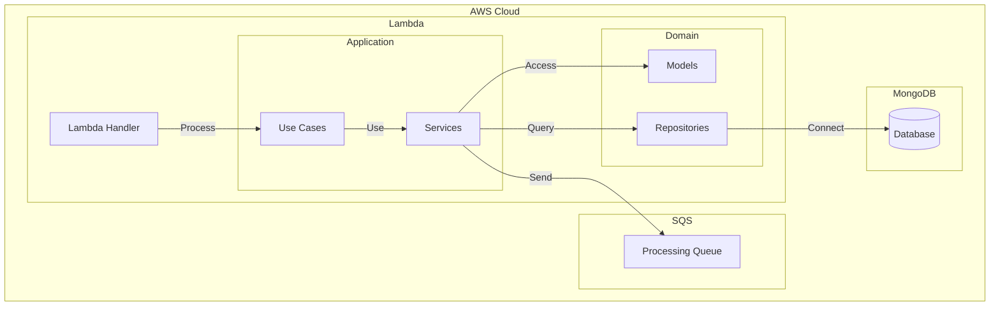
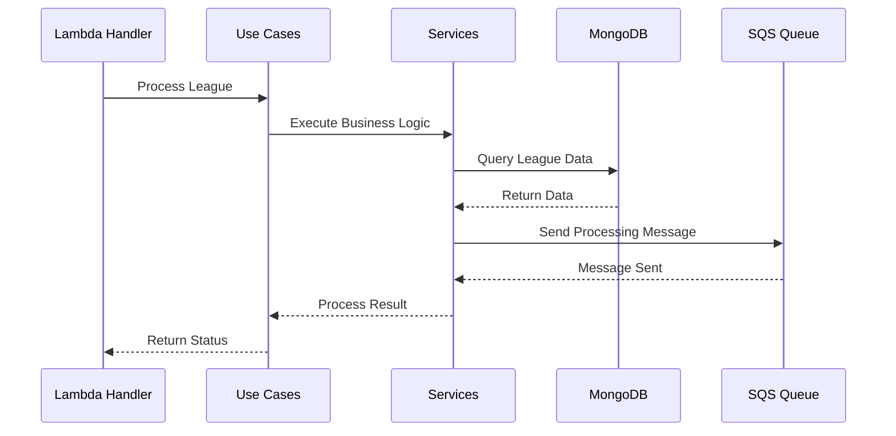

# Architecture

## Overview
The League Process Ranking Scheduler is a serverless service that uses AWS Lambda and SQS to process league rankings. The service follows a clean architecture pattern with clear separation of concerns.

## Architecture Diagram

## Sequence Diagram

## System Layers

### Application Layer
- Use cases for business logic
- Service orchestration
- Data processing flow

### Domain Layer
- Business models and entities
- Repository interfaces
- Domain rules and validations

### Infrastructure Layer
- MongoDB connection and queries
- AWS SQS integration
- External service communication

## Data Flow
1. Lambda handler processes the request
2. Use cases execute business logic
3. Services interact with repositories
4. Data is queried from MongoDB
5. Results are sent to SQS queue
6. Processing status is returned

## Security Considerations
- IAM roles for AWS services
- MongoDB connection security
- Environment variable encryption
- SQS message validation
- SSL/TLS for database connections

## Scalability
- Serverless architecture for automatic scaling
- SQS for message processing
- Connection pooling for MongoDB
- Asynchronous operations 